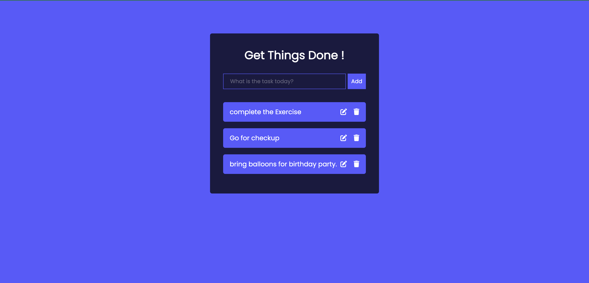

## Todo List Application using pure vanilla javascript

Simple App to Manage your daily work Todo's -

Click here [Live Demo](https://amanbnl.github.io/todo-list-using-vanilla-js/) for the live demo.



## Getting Started 🚀

To start using this, clone this repo to a new directory:

```bash
git clone https://github.com/amanbnl/todo-list-using-vanilla-js.git
```
and run index.html using live server (if you have installed live serve extension in your code editor) or run index.html file manually
## Contributing 👏
- :octocat: [Pull requests](https://github.com/amanbnl/todo-list-using-vanilla-js/pulls) and 🌟 stars are always welcome.
- For changes, please open an [issue](https://github.com/amanbnl/todo-list-using-vanilla-js/issues) first to discuss what you would like to change.
## Contact 📩
📧 amanbnl6501@gmail.com

💼 Linkedin [@AmandeepSingh](https://www.linkedin.com/in/amandeep-singh-24a82b247/)

## License
MIT &copy; [AmandeepSingh](https://github.com/amanbnl)
